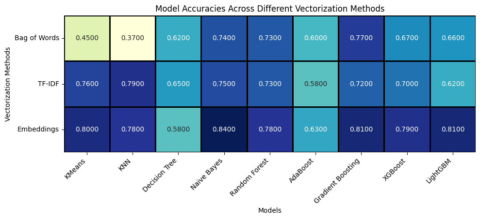
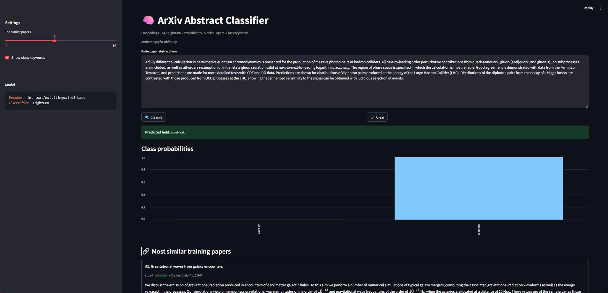
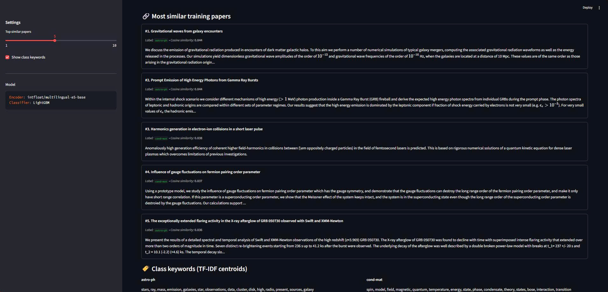

# 🧠 ArXiv Abstract Classifier

**ArXiv Abstract Classifier** is an end-to-end Machine Learning web application built with **Streamlit**, designed to automatically **classify scientific paper abstracts** (from arXiv) into major research domains.  

The model leverages **Sentence Embeddings (E5)** and a **LightGBM classifier**, offering both interpretability (via SHAP) and interactivity through an intuitive web interface.

---


## 🧩 Project Overview

This project extends the research and code in `PaperAbstractModelingSHAP.ipynb` into a full web application.  
It covers the **complete ML workflow**:  
data preprocessing → feature engineering → model training → explainability → deployment.

### 🎯 Objectives
- Automatically classify arXiv paper abstracts into their respective scientific domains.
- Compare and evaluate various text representation techniques:
  - Bag of Words
  - TF-IDF
  - Sentence Embeddings (E5)
- Experiment with multiple ML algorithms:
  - RandomForest, AdaBoost, GradientBoosting, XGBoost, LightGBM
- Explain model predictions using SHAP values.
- Provide a clean, interactive UI for inference and analysis.

### 📈 Experimental Result

The figure below shows comparative accuracies of multiple ML algorithms with different vectorization methods.



| Representation | Model | Accuracy |
|----------------|--------|-----------|
| Bag of Words | Naive Bayes | ~0.75 |
| TF-IDF | KNN | ~0.8 |
| **E5 Embeddings** | **LightGBM**, **Naive Bayes**, **GB** | **0.80+** |

**LightGBM with E5 embeddings achieved the best overall performance.**

---

## 📚 Categories

The classifier predicts one of the following **five scientific fields**:

| Label | Description |
|--------|--------------|
| `astro-ph` | Astrophysics |
| `cond-mat` | Condensed Matter Physics |
| `cs` | Computer Science |
| `math` | Mathematics |
| `physics` | General Physics |

---

## 🧠 Machine Learning Pipeline

### **1️⃣ Data Preprocessing**
- Dataset: [`UniverseTBD/arxiv-abstracts-large`](https://huggingface.co/datasets/UniverseTBD/arxiv-abstracts-large)
- Filter only abstracts with single labels among the five main domains.
- Text cleaning:
  - Lowercasing, punctuation removal, tokenization
  - Stopword removal using `nltk`

---

### **2️⃣ Feature Representation**
| Method | Description |
|--------|-------------|
| **Bag of Words** | Count vectorization of tokens |
| **TF-IDF** | Weighted term frequency emphasizing unique words |
| **E5 Embeddings** | Sentence-level dense representations using `intfloat/multilingual-e5-base` |

---

### **3️⃣ Models Evaluated**
| Algorithm | Notes |
|------------|-------|
| KMeans / KNN | Baseline clustering & similarity methods |
| Decision Tree / Naive Bayes | Fast interpretable models |
| RandomForest / AdaBoost / GradientBoosting | Ensemble-based strong baselines |
| XGBoost | High-performing gradient boosting |
| **LightGBM** | Final production model due to superior accuracy & inference speed |

---

### **4️⃣ Evaluation Metrics**
- **Accuracy** – overall model performance  
- **Precision / Recall / F1-score** – per class metrics  
- **Confusion Matrix** – class-level error distribution  
- **Coherence Score (LDA)** – for topic interpretability  

---

### **5️⃣ Explainability (SHAP)**
Model interpretability powered by **SHAP (SHapley Additive exPlanations)**:
- Global and local feature contributions.
- Visualizations:
  - `summary_plot`
  - `violin_plot`
  - `heatmap`

These explain how features (or words) influenced model predictions.

---

## 🌐 Web Application

The Streamlit app (`app.py`) provides:
- 🧾 **Input**: Abstract text of a scientific paper.
- 🎯 **Output**: Predicted research field + confidence probabilities.
- 📊 **Extras**:
  - Top similar papers (via cosine similarity on embeddings)
  - Representative keywords per class (via TF-IDF)
  - Visualization of probability distribution

### 🖼️ User Interface Preview

Below is the demo of the deployed web application.  
Users can paste a scientific abstract, classify it, and visualize prediction probabilities and similar papers.

### 🌐 Web Interface – Classification Panel


### 📊 Web Interface – Similar Papers & Keywords


---

## 🧰 Tech Stack

| Layer | Tools / Frameworks |
|--------|--------------------|
| **Language** | Python 3.10+ |
| **Frontend** | Streamlit |
| **ML Frameworks** | scikit-learn, LightGBM |
| **Embeddings** | SentenceTransformers (E5) |
| **Explainability** | SHAP |
| **Visualization** | Matplotlib, Seaborn |
| **Deployment** | Streamlit Cloud / Hugging Face Spaces |

---

---

## 🧪 Local Setup & Run

### 1️⃣ Clone the repository
```bash
git clone https://github.com/NhatHuy1110/ArXiv_Abstract_Classifier.git
cd ArXiv_Abstract_Classifier
```

### 2️⃣ Create a virtual environment (recommended)
```bash
python -m venv venv
source venv/bin/activate       # For macOS/Linux
venv\Scripts\activate          # For Windows
```

### 3️⃣ Install dependencies
Make sure you have pip updated first:
```bash
pip install --upgrade pip
```
Then install the project dependencies:
```bash
pip install -r requirements.txt
```

### 4️⃣ (Optional) Train the model
If you want to retrain the model using the ArXiv dataset:
```bash
python train.py
```
This will:
- Download and preprocess the dataset.
- Train LightGBM with E5 embeddings.
- Save artifacts into the artifacts/ directory.

### 5️⃣ Run the Streamlit web app
Once artifacts exist (or are downloaded), start the web app locally:
```bash
streamlit run app.py
```

---

## 🧑‍💻 Author
Nguyễn Nhất Huy

AI Researcher & Engineer

📧 Email: huynhatnguyen1110@gmail.com

